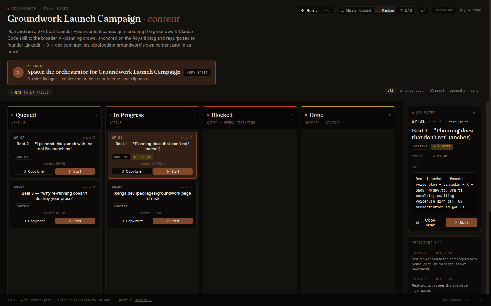
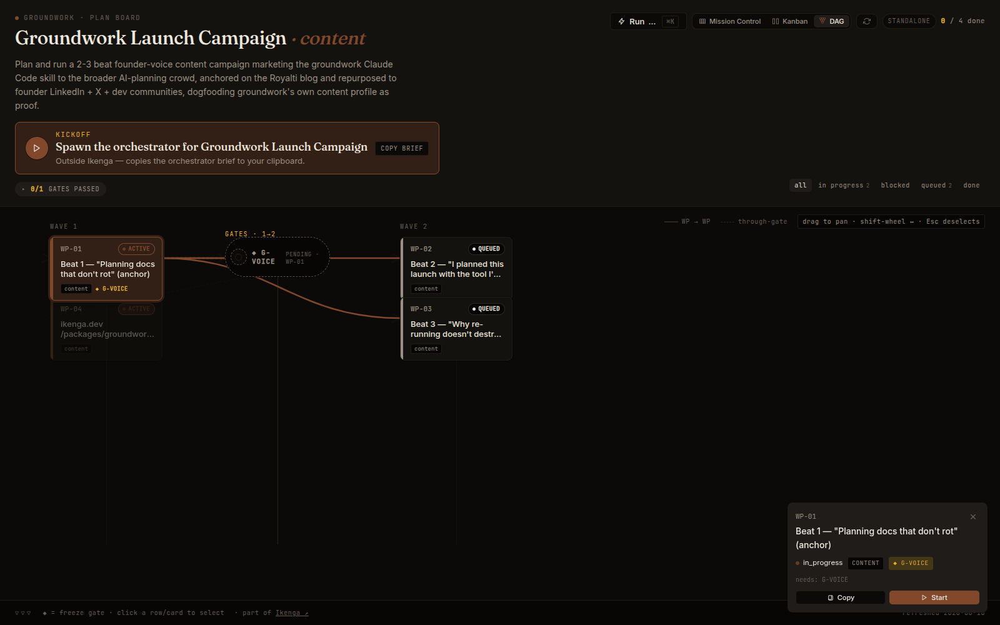
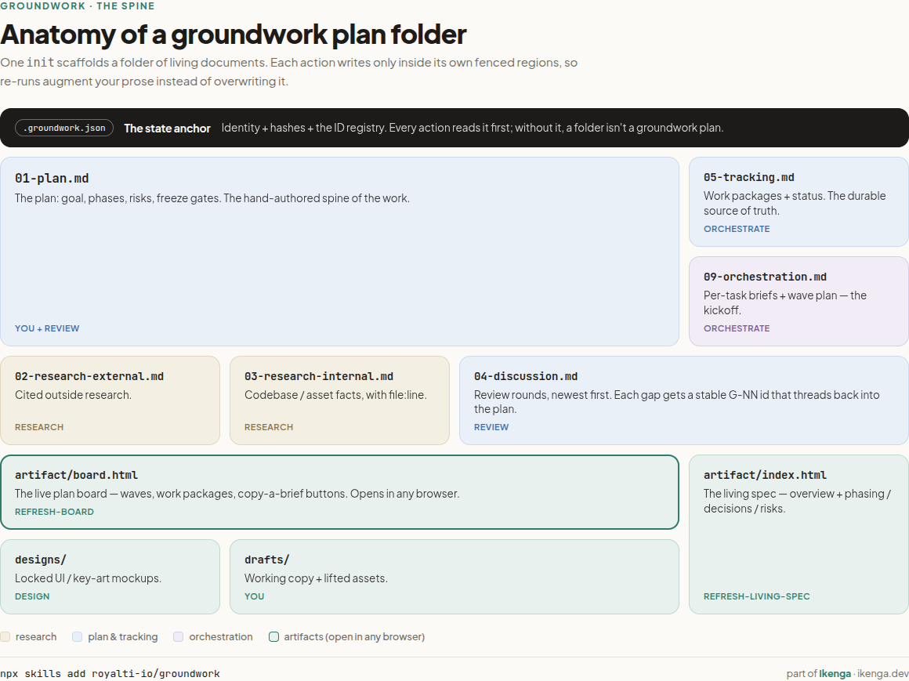
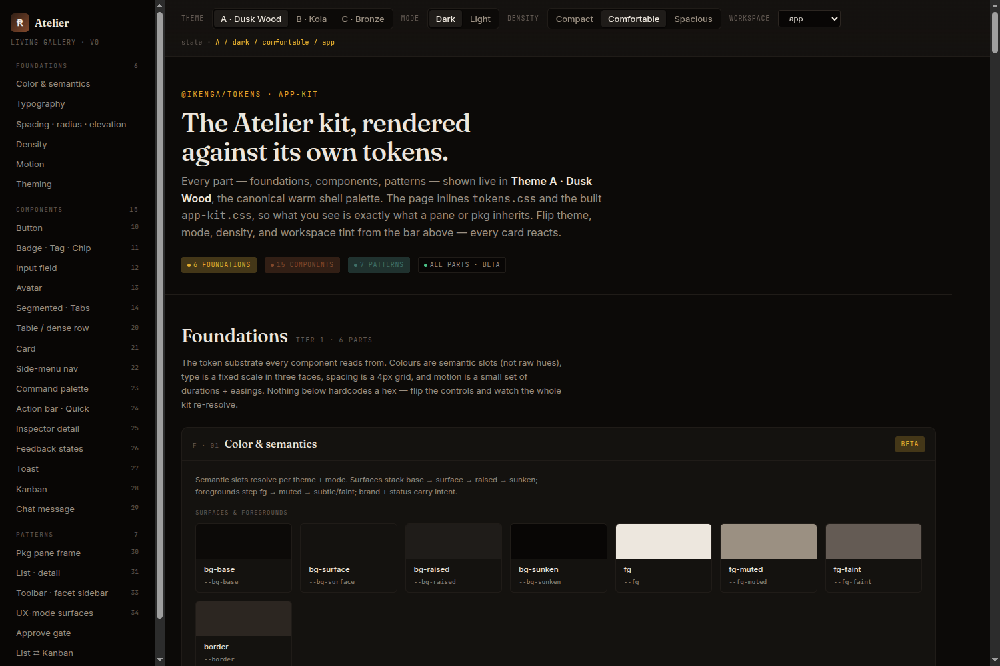

# groundwork

**A Claude Code skill that scaffolds and maintains a living plan folder. Re-runs augment your work — they never overwrite it.**

```bash
npx skills add royalti-io/groundwork
```

Works with Claude Code, Codex, Gemini, Cursor, and 70+ other agents.

---

## Quickstart demo

<!-- Interactive demo — open in a browser: assets/quickstart-demo.html -->

**[▶ Open interactive quickstart demo](assets/quickstart-demo.html)**
*(init → research → review → orchestrate — 4 steps, keyboard-navigable)*

---

## What it does

You give groundwork a goal. It scaffolds a folder of numbered, living documents — a plan, two research files, a discussion log, a tracking file, and a standalone HTML board you can open in any browser. Then it gives you a small set of actions you can run at any time: `research`, `design`, `review`, `orchestrate`, `refresh-board`.

The part that matters: every block the skill generates is wrapped in a fenced region. **Everything outside a fence is yours and is never touched.** When you re-run an action, a checksum decides what changes on disk — not the model. A vibe you can't trust; a sha256 you can.

---

## Plan board

The board reads your tracking file and renders three views: mission control, Kanban, and a dependency-graph of your wave plan.





It is a [self-contained HTML artifact](https://ikenga.dev): open it in any browser, no server needed. Inside the Ikenga workspace it renders live next to your running sessions.

---

## The folder shape

```
plans/your-feature/
├── .groundwork.json          ← identity + state anchor
├── 00-README.md              ← north star + links
├── 01-plan.md                ← goal, phases, architecture, risks
├── 02-research-external.md   ← prior art, competitors, libraries
├── 03-research-internal.md   ← codebase, schema, constraints
├── 04-discussion.md          ← review rounds, newest-first
├── 05-tracking.md            ← WPs, deps, DoDs, status
├── 09-orchestration.md       ← wave plan + per-WP kickoff briefs
└── artifact/
    └── board.html            ← standalone plan board
```



---

## Profiles

A profile swaps vocabulary and optional blocks — not the spine. The safe-regeneration machinery is identical across all four.

| Profile | For | Work unit |
|---|---|---|
| `software` | Features, code work | work package / PR |
| `general` | Campaigns, org changes, non-code | workstream / deliverable |
| `content` | Editorial work, content series | piece / asset |
| `design-system` | Component/token systems | part |

The `design-system` profile adds a parts gallery, token pipeline, and a per-part quality gate.



---

## Action set

| Action | What it does |
|---|---|
| `init` | Interview + scaffold the folder skeleton |
| `research` | Fill `02`/`03` research files (external + internal) |
| `design` | Produce ≥2 comparable design options, lock one |
| `subplan` | Scaffold a focused sub-plan (diff-plan / decision-doc / bug-doc) |
| `review` | Gap analysis → new Round in `04` → re-sync tracking |
| `clarify` | Readiness gate before `orchestrate` |
| `orchestrate` | Emit `09-orchestration.md` with wave plan + WP briefs |
| `refresh-board` | Regenerate `artifact/board.html` from current docs |
| `status` | Read-only freshness + ID + coverage report |

Add `--emit-workflow` to `orchestrate` for a runnable Claude Code Workflow that fans waves out in parallel and turns freeze gates into sign-off barriers.

---

## Install

### `npx skills` (recommended)

```bash
# Global — available across all projects
npx skills add royalti-io/groundwork -g

# Project — committed with your repo, shared with the team
npx skills add royalti-io/groundwork
```

### Git clone

```bash
git clone https://github.com/royalti-io/groundwork.git
cp -r groundwork/skills/groundwork ~/.claude/skills/
```

### Curl one-liner

```bash
curl -sSL https://raw.githubusercontent.com/royalti-io/groundwork/main/install.sh | bash
```

The installer drops the skill into `~/.claude/skills/groundwork/` via symlink
against a cached clone in `~/.cache/ikenga-skills/`, so `git pull` is the
update path.

---

## Usage

After install, in any Claude Code session:

```
/groundwork init plans/<your-plan>/ --profile software --goal "…"
```

Then run actions as the work progresses:

```
/groundwork research plans/<your-plan>/
/groundwork review plans/<your-plan>/
/groundwork orchestrate plans/<your-plan>/
```

See [`skills/groundwork/SKILL.md`](skills/groundwork/SKILL.md) for the full agent-facing spec.

---

## Further reading

- **Blog post:** [I built a planning skill because my plans kept rotting](https://royalti.io/blog/groundwork-planning-that-doesnt-rot)
- **Docs:** [ikenga.dev/packages/groundwork](https://ikenga.dev/packages/groundwork)
- **Ikenga workspace:** [ikenga.dev](https://ikenga.dev)

---

## License

[Apache-2.0](LICENSE). Copyright © 2026 Royalti.io.
